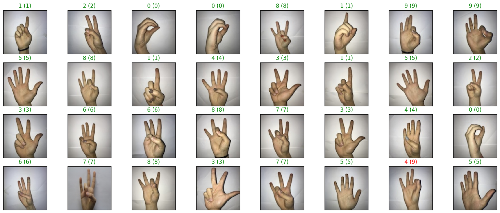

# ✋ Sign Language Classification with VGG16

This project implements a deep learning-based **Sign Language Classification** system using **Transfer Learning (VGG16)** and **TensorFlow/Keras**.  
It classifies hand signs representing digits **0–9** using a dataset prepared by ***[Turkey Ankara Ayrancı Anadolu](http://ayrancianadolu.meb.k12.tr)*** High School students.

---

## 🚀 Features
- Transfer learning using pretrained **VGG16** on ImageNet.
- Fine-tuned classifier for **10 sign language digit classes** (0–9).
- Model training with **checkpoint saving** (best model only).
- Evaluation on test data with **accuracy & loss metrics**.
- Visualization of predictions with correct/incorrect classification coloring.
- **Confusion matrix** for detailed performance insights.

---

## 📦 Installation

```bash
# Clone the repository
git clone https://github.com/faisal-ajao/sign-language-classification.git
cd sign-language-classification

# (Optional) Create a virtual environment
python -m venv venv
source venv/bin/activate   # Linux/Mac
venv\\Scripts\\activate    # Windows

# Install dependencies
pip install -r requirements.txt
```

---

## ▶️ Usage

Train the model:

```bash
python main.py
```

Or run interactively in **Jupyter Notebook**:

```bash
jupyter notebook main.ipynb
```

### Outputs:
- ✅ Model checkpoints saved as `model.sign_language.keras`  
- ✅ Accuracy and loss printed for test data  
- ✅ Visualization of predictions on sample test images  
- ✅ Confusion matrix for detailed evaluation  

---

## 📊 Output Example  
  
*(Green → Correct | Red → Incorrect)*

---

## 📂 Project Structure
```text
sign-language-classification/
├── dataset/              # Dataset folders
│   ├── train/
│   ├── valid/
│   └── test/
├── main.py               # Main training & evaluation script
├── main.ipynb            # Jupyter Notebook version
├── output.png
├── requirements.txt      # Dependencies
├── README.md
└── LICENSE
```

---

## 🧠 Tech Stack
- Python 3.10  
- TensorFlow / Keras  
- Scikit-learn  
- OpenCV  
- NumPy  
- Matplotlib  

---

## 📜 License
This project is licensed under the MIT License – see the [LICENSE](LICENSE) file for details.

## Install dependencies
```bash
pip install -r requirements.txt
```
